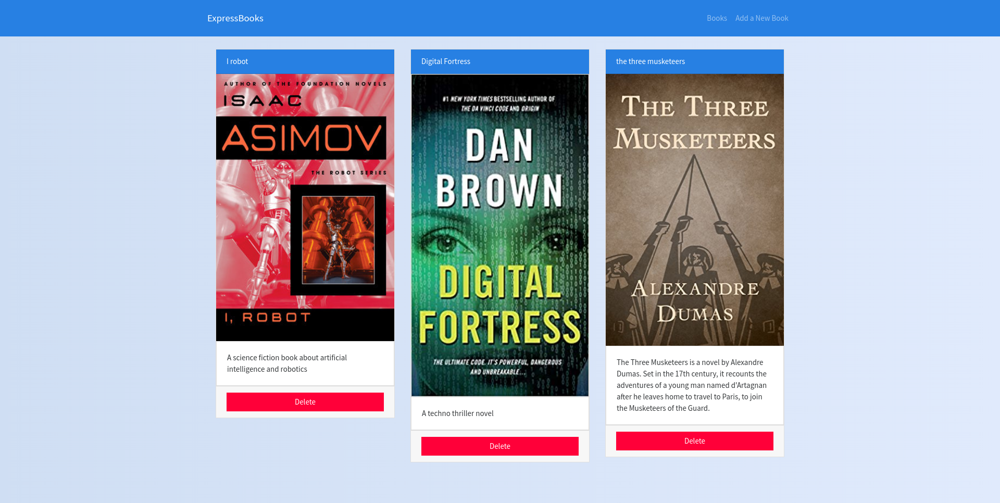

# Express Books

Express Books is Web Application to save a list of your favorite books. All data are store in a Json file.

# ScreenShoot



# Installation

```shell
git clone https://github.com/FaztTech/books-express
npm install
npm run build
npm start
```

# 📝 Task & Notes Manager — Plataforma PaaS con Node.js y Express


## 🚀 Descripción del Proyecto
Esta aplicación permite gestionar notas o tareas a través de una interfaz web dinámica construida con Node.js, Express y EJS. Funciona como una **plataforma PaaS (Platform as a Service)** que facilita a los usuarios el acceso, creación y eliminación de notas sin necesidad de instalar software localmente. El proyecto está diseñado para ejecutarse en la nube mediante contenedores Docker y pipelines de integración continua, simplificando el despliegue y la escalabilidad.

## ⚙️ Estructura del Proyecto
├── src/
│   ├── controllers/
│   │   └── index.controller.js       # Controladores principales (lógica CRUD)
│   ├── routes/
│   │   └── index.js                  # Definición de rutas y endpoints
│   ├── views/
│   │   ├── partials/                 # Fragmentos EJS reutilizables
│   │   ├── index.ejs                 # Página principal (lista de tareas)
│   │   ├── new-entry.ejs             # Formulario para nuevas notas
│   │   ├── about.ejs                 # Página informativa
│   │   └── 404.ejs                   # Página de error
│   ├── public/css/
│   │   └── main.css                  # Estilos generales
│   ├── books.json                    # Archivo JSON usado como base de datos local
│   ├── config.js                     # Configuración global del proyecto
│   └── app.js                        # Inicialización del servidor Express
├── test/
│   └── basic.test.js                 # Pruebas unitarias básicas
├── Dockerfile                        # Imagen Docker para despliegue
├── .gitlab-ci.yml                    # Pipeline CI/CD (GitLab)
├── .github/workflows/javascript.yml  # Workflow GitHub Actions
├── package.json                      # Dependencias y scripts de npm
├── README.md                         # Documentación del proyecto

## 💡 Funcionamiento General
El sistema implementa un flujo CRUD simple (Create, Read, Delete) sobre un archivo JSON. Los controladores en `src/controllers/index.controller.js` manejan las peticiones y renderizan vistas dinámicas mediante EJS.  
- **renderIndexPage:** muestra todas las notas cargadas desde `books.json`.  
- **renderNewEntryPage:** despliega el formulario para crear una nueva nota.  
- **createNewEntry:** recibe los datos del formulario (título, autor, imagen, descripción), genera un ID único con UUID y guarda la nota en el archivo JSON.  
- **deleteBook:** elimina una nota por su ID y actualiza el archivo JSON.  

La información se procesa con `fs` (File System) y se almacena localmente en formato JSON, actuando como una base de datos ligera. Esto permite un entorno simple pero funcional para entornos educativos o despliegues rápidos en plataformas PaaS.

## 🌐 Enfoque PaaS
El proyecto está pensado para ejecutarse en plataformas cloud como **Heroku, Render o Railway**, donde se despliega como servicio PaaS. Esto permite:
- Escalabilidad automática sin gestión de infraestructura.
- Despliegue mediante contenedores Docker o pipelines CI/CD.
- Facilidad para exponer la aplicación a través de dominios públicos HTTPS.
- Accesibilidad desde cualquier dispositivo con conexión a Internet.

## 🧩 Tecnologías Utilizadas
- **Node.js** — entorno de ejecución backend.
- **Express.js** — framework para la gestión de rutas y controladores.
- **EJS** — motor de plantillas para vistas dinámicas.
- **JSON** — persistencia de datos ligera.
- **Docker** — contenedor para despliegue cloud.
- **GitHub Actions / GitLab CI** — automatización de pruebas y despliegue continuo.

## 🧪 Ejecución Local
```bash
# Clonar el repositorio
git clone https://github.com/tuusuario/task-notes-manager.git
cd task-notes-manager

# Instalar dependencias
npm install

# Ejecutar el servidor en modo desarrollo
npm run dev

# Acceder desde el navegador
http://localhost:3000
